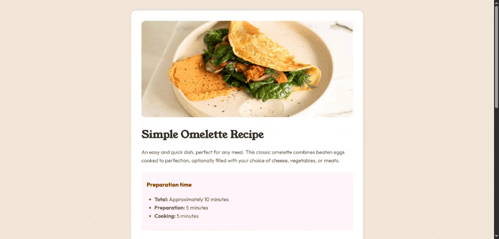

# 👨‍🍳Recipe Page

This is a solution to the [Recipe page challenge on Frontend Mentor](https://www.frontendmentor.io/challenges/recipe-page-KiTsR8QQKm). It showcases a simple omelette recipe with ingredients, preparation steps, and nutrition facts — all styled to match a modern and clean design.

## 📹Live Demo

Check it out on Github Pages: [Recipe Page](https://julikss.github.io/frontend-mentor-challenges/recipe-page/)

## ⚒️ Built with

- Semantic HTML5
- CSS3

