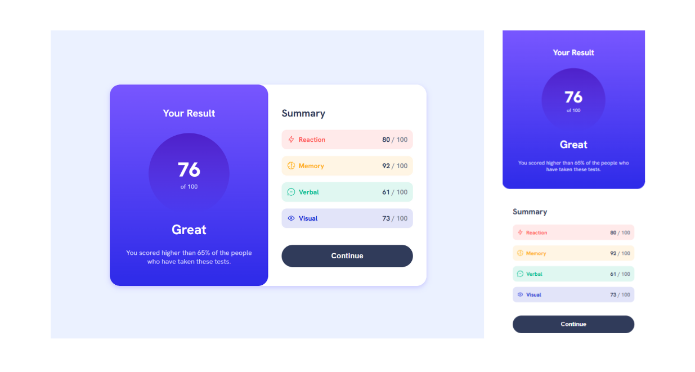

# 🔗 Results Summary Component

This is a solution to the [Results summary component challenge on Frontend Mentor](https://www.frontendmentor.io/challenges/results-summary-component-CE_K6s0maV). The goal of the challenge is to build a results summary card that displays the user's overall score and detailed performance in various categories, styled according to the provided design.

## 📹Live Demo

Check it out on Github Pages: [Results Summary Component](https://julikss.github.io/frontend-mentor-challenges/results-summary-component/)

## ⚒️ Built with

- Semantic HTML5
- CSS3