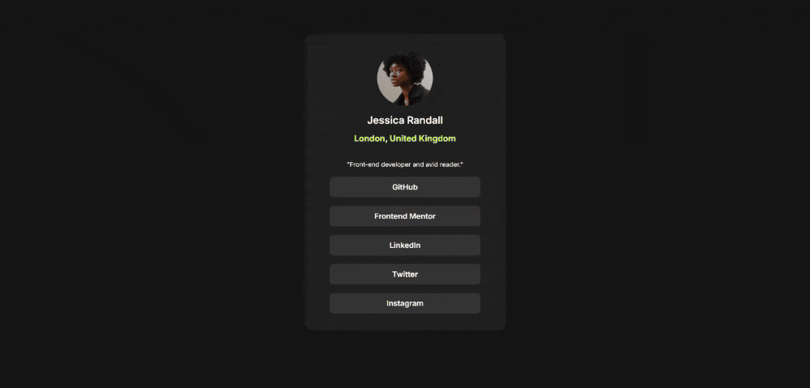

# 🔗 Social Links Profile

This is a solution to the [Social links profile challenge on Frontend Mentor](https://www.frontendmentor.io/challenges/social-links-profile-UG32l9m6dQ). The goal of the challenge is to build a user profile card that includes social media links, styled according to the provided design.

## 📹Live Demo

Check it out on Github Pages: [Social Links Profile](https://julikss.github.io/frontend-mentor-challenges/social-links-profile/)

## ⚒️ Built with

- Semantic HTML5
- CSS3